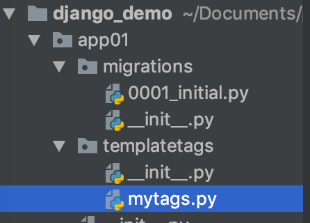

# django自定义标签和过滤器

> 当django自带的标签和过滤器不够用时，我们可以自定义自己的标签和过滤器供模板使用

1. 在app下创建一个python包，须包含`__init__.py`文件

2. 在包内建一个py文件，用来定义标签和过滤器

```python
from django import template

register = template.Library()

@register.filter
def mod2(num1):
    if num1 % 2 == 0:
        return True
    else:
        return False

@register.filter
def mod4(num1, num2):
    if num1 % num2 == 0:
        return True
    else:
        return False

@register.simple_tag
def mod3(num1, num2, num3):
    return num1 + num2 + num3
```

3. 在html文件里的开头处，导入要用到的python包里的py文件

```django
 # 自定义标签

 # 自定义过滤器
{{ book.id|mod2 }} # 自定义过滤器
```

> 注意：
> - 自定义过滤器可以传一个参数，这个参数就是django模板语言传过来的那个参数
> - 也可以传两个参数，第一个是模板语言传过来的那个，第二个是自己传的。
> - 自定义过滤器必须有返回值
> - 自定义标签主要用作数据处理，不可以用在if判断。自定义过滤器可以在if判断里使用
