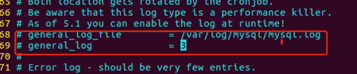

- 查看mysql数据库日志
查看mysql数据库日志可以查看对数据库的操作记录。 mysql日志文件默认没有产生，需要做如下配置：
`sudo vi /etc/mysql/mysql.conf.d/mysqld.conf`

把68，69行前面的#去除，然后保存并使用如下命令重启mysql服务。
`sudo service mysql restart`
使用如下命令打开mysql日志文件。
`sudo tail -f /var/log/mysql/mysql.log #可以实时查看数据库的日志内容`
> 适用于ubuntu
